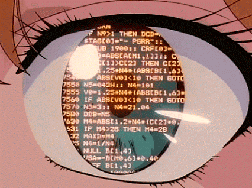
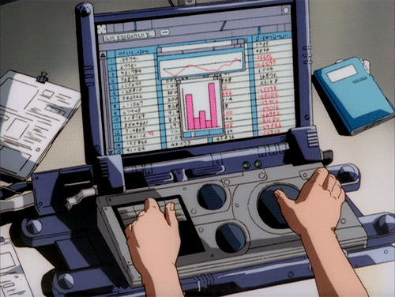

# Engineering Notes — Main Topics

<!-- Badges -->

  
   
  <em>Murakami Shiina</em>

---

## Table of Contents

- [Engineering Notes — Main Topics](#engineering-notes--main-topics)
  - [Table of Contents](#table-of-contents)
    - [OOP](#oop)
    - [Design Patterns](#design-patterns)
    - [Software Architecture](#software-architecture)
    - [Database Architecture](#database-architecture)
    - [Artificial Intelligence (AI)](#artificial-intelligence-ai)
  - [Conventions (useful as reference)](#conventions-useful-as-reference)
  - [Credits](#credits)

---

### OOP

  

    La Programación Orientada a Objetos (OOP) es un paradigma fundamental que permite modelar sistemas complejos mediante la organización de código en objetos que representan entidades del mundo real, facilitando la reutilización y mantenimiento.
  

  

    
    
<em>Digital Devil Story: Megami Tensei
</em>

  

---

### Design Patterns

  

    
    
<em>I Dream of Mimi, known as Buttobi!! CPU</em>

  

  

    Los patrones de diseño son soluciones probadas y reutilizables a problemas comunes en el diseño de software. Ayudan a crear sistemas flexibles, escalables y mantenibles mediante estructuras y comportamientos bien definidos.
  

---

### Software Architecture

  

    La arquitectura de software define la estructura general de un sistema, sus componentes y las relaciones entre ellos. Es clave para garantizar escalabilidad, mantenibilidad y calidad en sistemas complejos.
  

  

    
    
<em>Neon Genesis Evangelion</em>

  

---

### Database Architecture

  

    
    
<em>Unknown Source</em>

  

  

    La arquitectura de bases de datos abarca el diseño, organización y optimización de sistemas de almacenamiento de datos, esenciales para el rendimiento, integridad y escalabilidad de las aplicaciones.
  

---

### Artificial Intelligence (AI)

  

    La inteligencia artificial abarca un conjunto de tecnologías que permiten a las máquinas simular capacidades humanas como el razonamiento, el aprendizaje y la percepción. Se utiliza para optimizar procesos, tomar decisiones basadas en datos y crear sistemas adaptativos en múltiples dominios.
  

  

    
    
<em>Ghost in the Shell</em>

  

---

## Conventions (useful as reference)

- **Bold**: términos importantes  
- _Italic_: aclaraciones o sinónimos  
- `Code`: fragmentos técnicos o ejemplos

---

## Credits

Ilustración estilo anime utilizada con fines personales para inspirar y establecer el tono del contenido.
